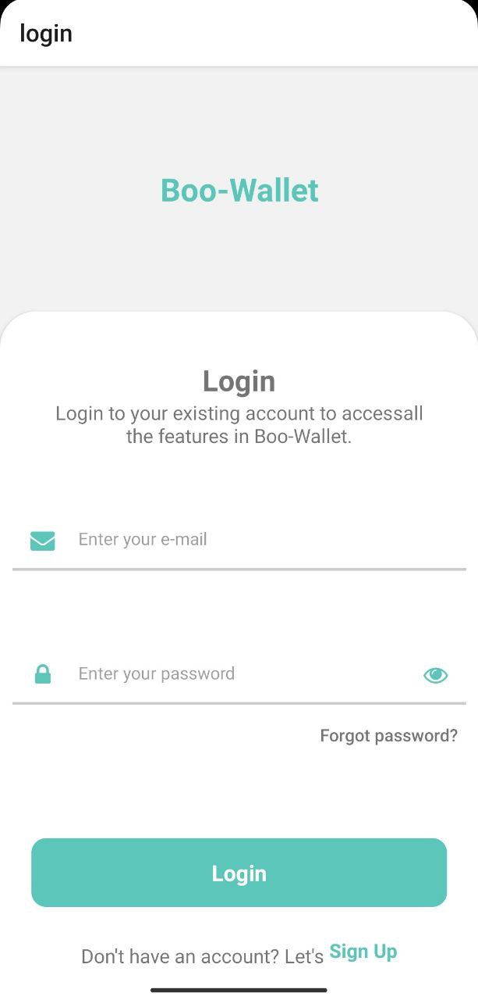
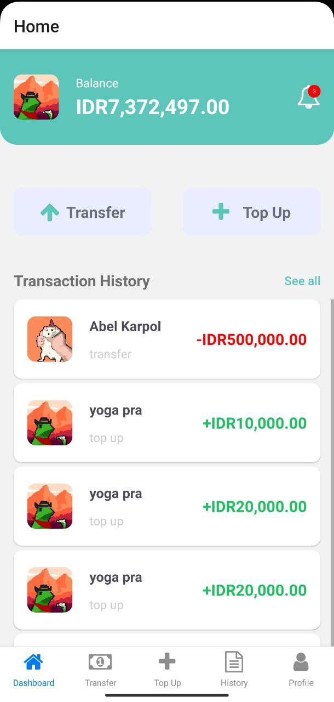
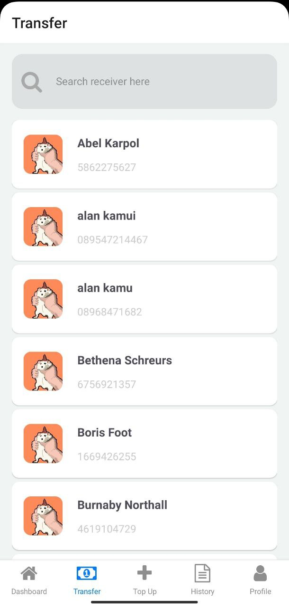
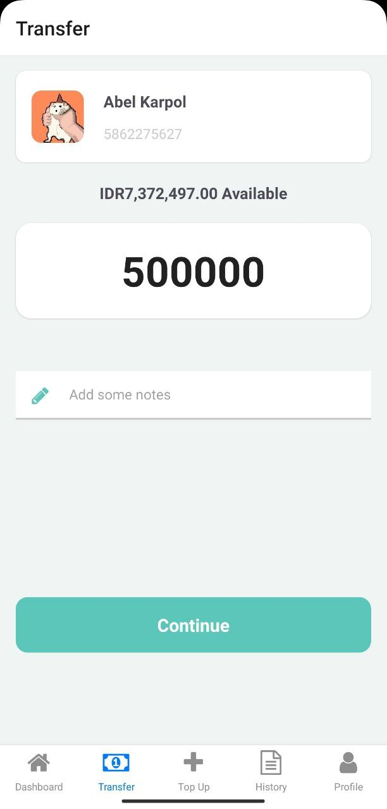
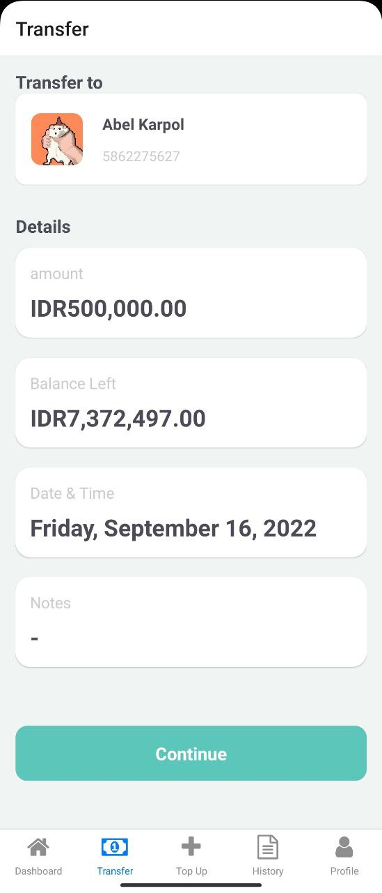
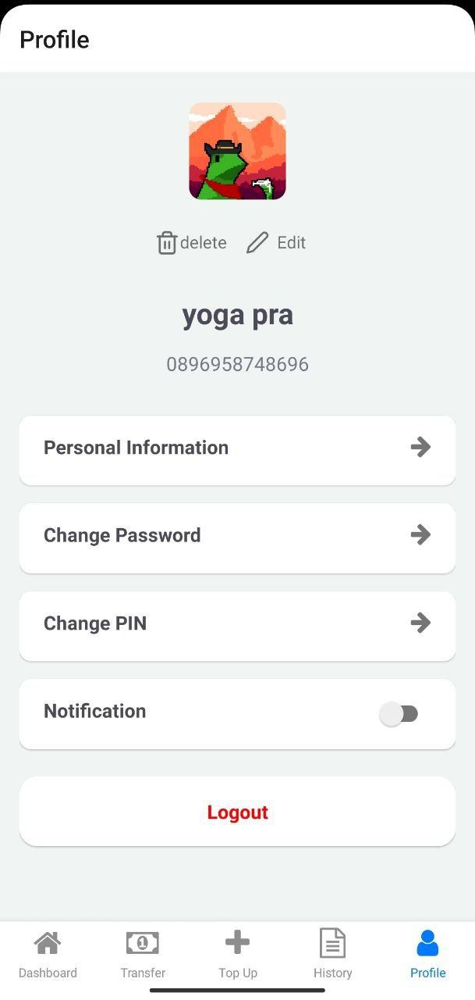

# React_Native - Boo-wallet E-Wallet

  
   
  
   
  
   
   

## About
- Login
- Register
- Transaction
- Topup
- Edit profile

## Built With
- [React Native](hhttps://reactnative.dev/)

## Requirements
1. Node_modules, type in terminal `npm install or yarn install`
2. Backend API [here](https://github.com/sen9kuni/fw9-backend)

## How to run app?
1. Clone this project to your local computer
2. Open this project in your code editor and type `npm install or yarn install` in terminal
3. Edit url on `src/helpers/http`
`const url = your backend;`
4. type `yarn start` or `npm start` on terminal

## Acknowledgements
- [Axios](https://axios-http.com/)
- [React Redux](https://react-redux.js.org/)